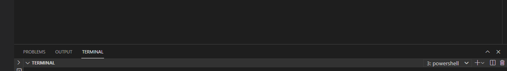
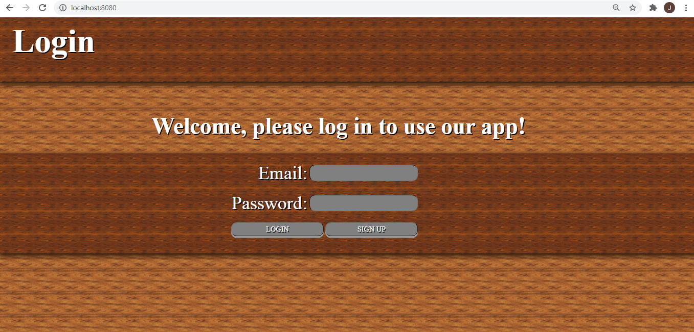

# How to install

## Requirements

1. Visual studio code
2. Node.js

## Instructions

Once you have the requirements installed you can run the program by:

1. Extract .zip, or clone from the git repo: https://github.com/UP959846/Plagiarism-Detection-Tool

2. Open terminal in Visual Studio Code

3. Run the command: cd "/__directory_web_application_stored_in"

4. Run the command: npm start

5. Open browser and visit: http://localhost:8080/

6. Enjoy my Plagiarism Detection Web Application!